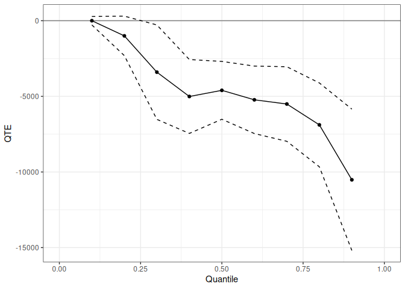

<!-- README.md is generated from README.qmd. Please edit that file. -->

# qte — Quantile Treatment Effects in R 

<!-- badges: start -->

[](https://CRAN.R-project.org/package=qte)
[](https://github.com/bcallaway11/qte/actions/workflows/R-CMD-check.yaml)
<!-- badges: end -->

## Overview

The `qte` package provides methods for estimating Quantile Treatment
Effects (QTE) and Quantile Treatment Effects on the Treated (QTT) in R.
Where the average treatment effect summarizes the impact of a policy by
a single number, the QTE describes how treatment effects vary across the
outcome distribution — useful whenever the policy’s impact is
heterogeneous or when distributional consequences (e.g., for inequality)
are of interest.

**Cross-sectional estimators** (no panel data required):

- `unc_qte()` — QTE/QTT under unconfoundedness (IPW, outcome regression,
  or doubly robust); covers random assignment as a special case

**Panel and repeated cross-section estimators** (staggered treatment
adoption supported for all):

- `cic()` — Change in Changes (Athey and Imbens 2006)
- `qdid()` — Quantile Difference-in-Differences (Athey and Imbens 2006;
  Meyer, Viscusi, and Durbin 1995)
- `panel_qtt()` — Panel QTT via copula stability (Callaway and Li 2019)
- `ddid()` — Distributional Difference-in-Differences (Callaway and Li
  2019)
- `mdid()` — Mean Difference-in-Differences (Thuysbaert 2007)
- `lou_qtt()` — Lagged-outcome unconfoundedness QTT

## Installation

``` r
# Install from CRAN:
install.packages("qte")

# Install the development version from GitHub:
# install.packages("remotes")
remotes::install_github("bcallaway11/qte")
```

## Quick start — unconfoundedness

The `unc_qte()` function estimates the QTE or QTT under an
unconfoundedness assumption. Here we use the observational Lalonde
(1986) data to estimate the QTT of a job training program, controlling
for pre-treatment characteristics via doubly robust estimation.

``` r
data(lalonde)

xf <- ~ age + I(age^2) + education + black + hispanic + married + nodegree

res_cs <- unc_qte(
  yname      = "re78",
  dname      = "treat",
  data       = lalonde.psid,
  xformla    = xf,
  est_method = "aipw",
  target     = "qtt",
  probs      = seq(0.1, 0.9, 0.1),
  biters     = 100
)
summary(res_cs)
#> 
#> Overall ATT:  
#>        ATT    Std. Error     [ 95%  Conf. Int.]  
#>  -4685.583      855.4827  -6362.298   -3008.868 *
#> 
#> 
#> QTT:
#>  Tau         QTT Std. Error [ 95% Simult.  Conf. Band]  
#>  0.1      0.0001   142.1003      -278.5113    278.5114  
#>  0.2  -1002.7420   666.7031     -2309.4561    303.9721  
#>  0.3  -3400.5673  1591.9883     -6520.8071   -280.3276 *
#>  0.4  -5009.2491  1245.6738     -7450.7249  -2567.7732 *
#>  0.5  -4602.4652   975.5104     -6514.4305  -2690.5000 *
#>  0.6  -5229.1454  1137.8351     -7459.2613  -2999.0296 *
#>  0.7  -5507.4720  1257.6699     -7972.4596  -3042.4843 *
#>  0.8  -6885.7529  1414.2328     -9657.5982  -4113.9076 *
#>  0.9 -10517.0625  2383.6646    -15188.9593  -5845.1657 *
#> ---
#> Signif. codes: `*' confidence band does not cover 0
```

Plot the QTT curve with a uniform confidence band:

``` r
autoplot(res_cs)
```



## Staggered treatment adoption

All panel estimators use a common `yname`/`gname`/`tname`/`idname`
interface and support staggered treatment adoption via
[ptetools](https://github.com/bcallaway11/ptetools). The example below
uses the `mpdta` dataset (county-level employment, from the `did`
package) with the Change in Changes estimator.

``` r
data(mpdta, package = "did")

res_att <- cic(
  yname   = "lemp",
  gname   = "first.treat",
  tname   = "year",
  idname  = "countyreal",
  data    = mpdta,
  gt_type = "att",
  biters  = 100
)
summary(res_att)
#> 
#> Overall ATT:  
#>      ATT    Std. Error     [ 95%  Conf. Int.] 
#>  -0.0197         0.015    -0.0494      0.0101 
#> 
#> 
#> Dynamic Effects:
#>  Event Time Estimate Std. Error [95% Simult.  Conf. Band]  
#>          -3   0.0508     0.0232        0.0053      0.0964 *
#>          -2   0.0158     0.0151       -0.0138      0.0455  
#>          -1  -0.0128     0.0161       -0.0444      0.0187  
#>           0  -0.0081     0.0147       -0.0368      0.0207  
#>           1  -0.0364     0.0219       -0.0792      0.0064  
#>           2  -0.1226     0.0360       -0.1932     -0.0520 *
#>           3  -0.0930     0.0402       -0.1717     -0.0142 *
#> ---
#> Signif. codes: `*' confidence band does not cover 0
```

Event-study plot showing pre-trends and post-treatment ATT by event
time:

``` r
autoplot(res_att, type = "dynamic")
```


The same estimator returns a full QTT curve when `gt_type = "qtt"`:

``` r
res_qtt <- cic(
  yname   = "lemp",
  gname   = "first.treat",
  tname   = "year",
  idname  = "countyreal",
  data    = mpdta,
  gt_type = "qtt",
  probs   = seq(0.1, 0.9, 0.1),
  biters  = 100
)
autoplot(res_qtt)
```


## Available estimators

| Function      | Method                             | Target     | Panel required |
|---------------|------------------------------------|------------|----------------|
| `unc_qte()`   | Unconfoundedness (IPW / OR / AIPW) | QTE or QTT | No             |
| `cic()`       | Change in Changes                  | ATT or QTT | Optional       |
| `qdid()`      | Quantile DiD                       | ATT or QTT | Optional       |
| `panel_qtt()` | Panel QTT (copula stability)       | QTT        | Yes            |
| `ddid()`      | Distributional DiD                 | ATT or QTT | Yes            |
| `mdid()`      | Mean DiD                           | ATT or QTT | Optional       |
| `lou_qtt()`   | Lagged-outcome unconfoundedness    | ATT or QTT | Yes            |

All panel estimators support staggered treatment adoption and return
group-specific, event-study, and overall aggregations.

## Documentation and vignettes

Full documentation and vignettes are available at the [pkgdown
site](https://bcallaway11.github.io/qte/):

- **Quantile Treatment Effects in R** — `unc_qte()` under random
  assignment and selection on observables
- **Panel Data Estimators for Quantile Treatment Effects** —
  identification assumptions and usage for all six panel estimators
- **Staggered Treatment Adoption** — applied workflow with `mpdta`: QTT
  curves, event-study plots, and cross-estimator comparison
