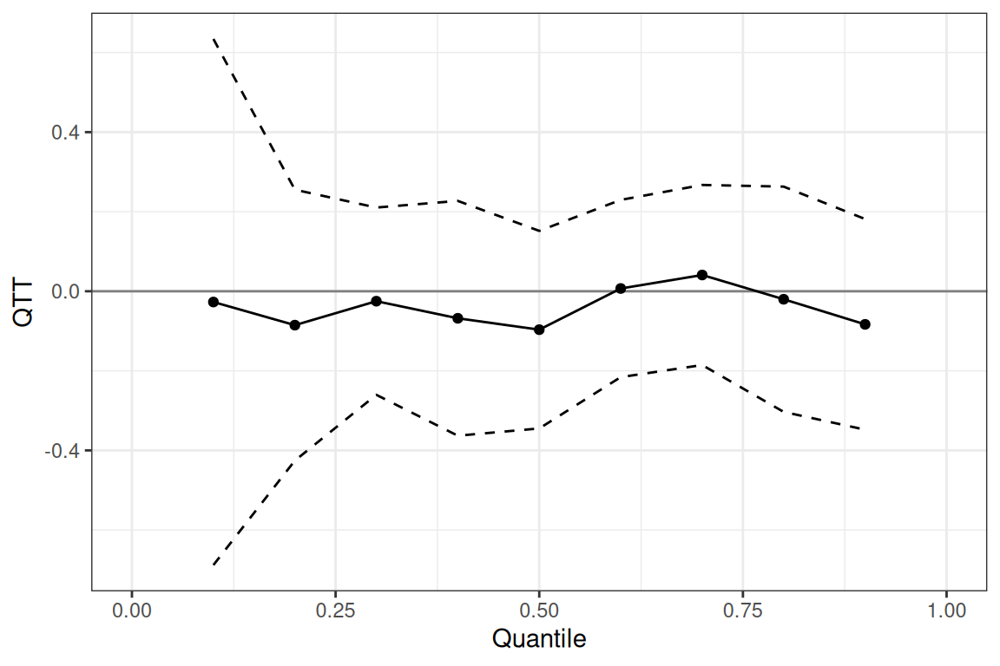

# Staggered Treatment Adoption with the qte Package

## Introduction

In many empirical settings, units adopt treatment at different points in
time — a structure called *staggered treatment adoption*. For example,
states may adopt a policy in different years, or firms may receive an
intervention at different times during a study period.

All DiD-based estimators in `qte` support staggered adoption via the
same interface: specify the outcome (`yname`), the
first-treatment-period cohort variable (`gname`, with 0 for
never-treated units), calendar time (`tname`), and a unit identifier
(`idname`). The package follows the approach of Callaway and Sant’Anna
([2021](#ref-callaway-santanna-2021)), computing group-time effects
$ATT(g,t)$ for every cohort $g$ and period $t$, then aggregating these
into overall, group-specific, and event-study (dynamic) summaries.

This vignette demonstrates the full applied workflow using the `mpdta`
dataset. For conceptual background on the identification assumptions
behind each estimator, see
[`vignette("did-estimators")`](https://bcallaway11.github.io/qte/articles/did-estimators.md).

``` r
library(qte)
library(ggplot2)
set.seed(42)
data(mpdta, package = "did")
```

`mpdta` is a balanced panel of 500 US counties observed annually from
2003 to 2007. The outcome is `lemp` (log county-level employment).
Counties are grouped by `first.treat`, the year they first adopted a
minimum wage increase (2004, 2006, or 2007); counties with
`first.treat == 0` never adopt.

``` r
table(mpdta$first.treat)
#> 
#>    0 2004 2006 2007 
#> 1545  100  200  655
```

------------------------------------------------------------------------

## ATT estimation and aggregation

We begin with the Change in Changes estimator
([`cic()`](https://bcallaway11.github.io/qte/reference/cic.md)) using
`gt_type = "att"`.

``` r
res_att <- cic(
  yname  = "lemp",
  gname  = "first.treat",
  tname  = "year",
  idname = "countyreal",
  data   = mpdta,
  biters = 50
)
```

### Overall ATT and event-study summary

[`summary()`](https://rdrr.io/r/base/summary.html) prints the overall
ATT and the event-study (dynamic) table. Event times $e < 0$ are
pre-treatment periods; $e \geq 0$ are post-treatment.

``` r
summary(res_att)
#> 
#> Overall ATT:  
#>      ATT    Std. Error     [ 95%  Conf. Int.] 
#>  -0.0197        0.0185    -0.0532      0.0139 
#> 
#> 
#> Dynamic Effects:
#>  Event Time Estimate Std. Error [95% Simult.  Conf. Band]  
#>          -3   0.0508     0.0176        0.0164      0.0853 *
#>          -2   0.0158     0.0159       -0.0154      0.0471  
#>          -1  -0.0128     0.0156       -0.0434      0.0178  
#>           0  -0.0081     0.0185       -0.0442      0.0281  
#>           1  -0.0364     0.0196       -0.0748      0.0020  
#>           2  -0.1226     0.0348       -0.1907     -0.0544 *
#>           3  -0.0930     0.0369       -0.1653     -0.0206 *
#> ---
#> Signif. codes: `*' confidence band does not cover 0
```

### Event-study plot

[`autoplot()`](https://ggplot2.tidyverse.org/reference/autoplot.html)
dispatches on the `pte_results` class and produces an event-study plot
by default. Use `type = "dynamic"` explicitly:

``` r
autoplot(res_att, type = "dynamic")
```


Pre-treatment estimates near zero support the identifying assumption.
The post-treatment pattern shows the estimated ATT in each period after
adoption.

------------------------------------------------------------------------

## QTT curve estimation

Setting `gt_type = "qtt"` returns the full Quantile Treatment Effect on
the Treated curve at each aggregation level. CDFs are mixed across
group-time cells first (using overall-ATT weights), then inverted at the
requested `probs` grid — this avoids the bias that would arise from
averaging scalar quantiles across cells.

``` r
res_qtt <- cic(
  yname   = "lemp",
  gname   = "first.treat",
  tname   = "year",
  idname  = "countyreal",
  data    = mpdta,
  biters  = 200,
  gt_type = "qtt",
  probs   = seq(0.1, 0.9, by = 0.1)
)
```

### Overall QTT curve

``` r
autoplot(res_qtt)
```


### Dynamic QTT — event-study by quantile

[`autoplot()`](https://ggplot2.tidyverse.org/reference/autoplot.html)
with `type = "dynamic"` plots the QTT at selected quantile(s) across
event times. The `plot_probs` argument selects which quantiles to show.

``` r
autoplot(res_qtt, type = "dynamic", plot_probs = 0.5)
```


Multiple quantiles can be overlaid by passing a vector to `plot_probs`
(values must be in the estimated `probs` grid):

``` r
autoplot(res_qtt, type = "dynamic", plot_probs = c(0.1, 0.5, 0.9))
```


------------------------------------------------------------------------

## ATT vs. QTT

Running the same estimator with both `gt_type = "att"` and
`gt_type = "qtt"` allows a direct comparison: is the distributional
effect constant (QTT ≈ ATT at all $\tau$), or does treatment shift the
distribution in a non-uniform way?

The overall ATT from `res_att` is approximately equal to the overall
mean of the QTT curve from `res_qtt` when effects are roughly uniform.
Deviations indicate distributional heterogeneity.

------------------------------------------------------------------------

## Comparing estimators

All six estimators share the same interface. Here we run three of them
with `gt_type = "att"` for a quick comparison of overall ATT estimates:

``` r
res_qdid <- qdid(
  yname = "lemp", gname = "first.treat", tname = "year",
  idname = "countyreal", data = mpdta,
  gt_type = "att", biters = 50
)

res_mdid <- mdid(
  yname = "lemp", gname = "first.treat", tname = "year",
  idname = "countyreal", data = mpdta,
  gt_type = "att", biters = 50
)

res_lou <- lou_qte(
  yname = "lemp", gname = "first.treat", tname = "year",
  idname = "countyreal", data = mpdta,
  gt_type = "att", biters = 50
)
```

``` r
overall_att <- function(res, label) {
  data.frame(
    estimator = label,
    att       = round(res$overall_results$att, 4),
    se        = round(res$overall_results$se,  4)
  )
}

do.call(rbind, list(
  overall_att(res_att,  "CiC"),
  overall_att(res_qdid, "QDiD"),
  overall_att(res_mdid, "MDiD"),
  overall_att(res_lou,  "Lagged-outcome unconfoundedness")
))
#>                         estimator     att     se
#> 1                             CiC -0.0197 0.0185
#> 2                            QDiD -0.0271 0.0159
#> 3                            MDiD -0.0305 0.0120
#> 4 Lagged-outcome unconfoundedness -0.0384 0.0193
```

Estimates will generally differ because each estimator relies on a
different identifying assumption. Similarity across methods strengthens
confidence in the findings; divergence warrants investigation of which
assumption is more plausible for the application.

------------------------------------------------------------------------

## Panel QTT and the `pre_copula` option

[`panel_qtt()`](https://bcallaway11.github.io/qte/reference/panel_qtt.md)
requires at least two pre-treatment periods per cohort to estimate the
copula that is transferred forward. The `pre_copula` argument controls
how the base period is chosen:

- `"long"` (default): the base period expands with the event horizon,
  making the copula window match the length of the post-treatment
  period. Requires more pre-treatment periods but is more internally
  consistent at longer horizons.
- `"short"`: always uses the two periods immediately before treatment,
  regardless of event horizon.

``` r
res_pqtt <- panel_qtt(
  yname      = "lemp",
  gname      = "first.treat",
  tname      = "year",
  idname     = "countyreal",
  data       = mpdta,
  pre_copula = "long",
  gt_type    = "qtt",
  probs      = seq(0.1, 0.9, 0.1),
  biters     = 200
)
autoplot(res_pqtt)
```



------------------------------------------------------------------------

## Repeated cross sections

If the data are repeated cross sections rather than a panel, set
`panel = FALSE` and omit `idname`. The CiC, QDiD, and MDiD estimators
support repeated cross sections;
[`ddid()`](https://bcallaway11.github.io/qte/reference/ddid.md),
[`panel_qtt()`](https://bcallaway11.github.io/qte/reference/panel_qtt.md),
and
[`lou_qte()`](https://bcallaway11.github.io/qte/reference/lou_qte.md)
require panel data.

``` r
res_rcs <- cic(
  yname  = "lemp",
  gname  = "first.treat",
  tname  = "year",
  data   = mpdta,   # no idname
  panel  = FALSE,
  biters = 50
)
```

------------------------------------------------------------------------

## Inference notes

Standard errors are computed via the empirical bootstrap, resampling
units (panel) or observations (repeated cross sections) with
replacement. The `biters` argument controls the number of iterations
(default 100; use 499 or more for publication results). Parallel
computation is available via the `cl` argument (`cl = 4` uses 4 cores).

The `cband = TRUE` default in
[`summary()`](https://rdrr.io/r/base/summary.html) and
[`autoplot()`](https://ggplot2.tidyverse.org/reference/autoplot.html)
produces uniform confidence bands (simultaneous coverage over all
quantiles or event times). Set `cband = FALSE` for pointwise intervals.

## References

Callaway, Brantly, and Pedro HC Sant’Anna. 2021.
“Difference-in-Differences with Multiple Time Periods.” *Journal of
Econometrics* 225 (2): 200–230.
