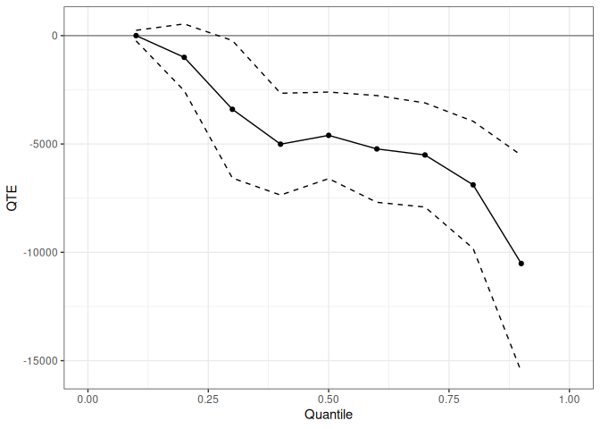
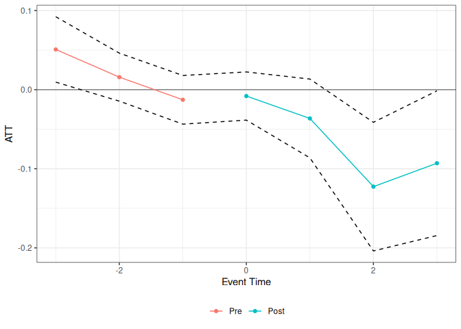
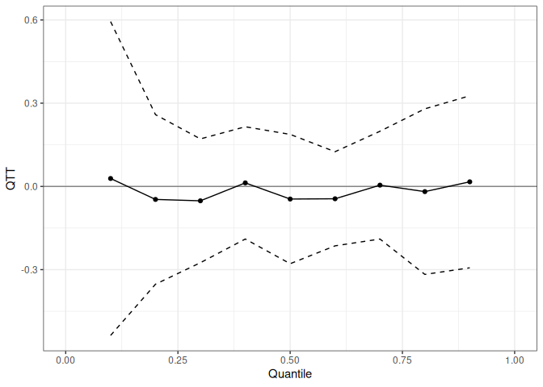

# qte — Quantile Treatment Effects in R

## Overview

The `qte` package provides methods for estimating Quantile Treatment
Effects (QTE) and Quantile Treatment Effects on the Treated (QTT) in R.
Where the average treatment effect summarizes the impact of a policy by
a single number, the QTE describes how treatment effects vary across the
outcome distribution — useful whenever the policy’s impact is
heterogeneous or when distributional consequences (e.g., for inequality)
are of interest.

**Cross-sectional estimators** (no panel data required):

- [`unc_qte()`](https://bcallaway11.github.io/qte/reference/unc_qte.md)
  — QTE/QTT under unconfoundedness (IPW, outcome regression, or doubly
  robust); covers random assignment as a special case

**Panel and repeated cross-section estimators** (staggered treatment
adoption supported for all):

- [`cic()`](https://bcallaway11.github.io/qte/reference/cic.md) — Change
  in Changes (Athey and Imbens 2006)
- [`qdid()`](https://bcallaway11.github.io/qte/reference/qdid.md) —
  Quantile Difference-in-Differences (Athey and Imbens 2006; Meyer,
  Viscusi, and Durbin 1995)
- [`panel_qtt()`](https://bcallaway11.github.io/qte/reference/panel_qtt.md)
  — Panel QTT via copula stability (Callaway and Li 2019)
- [`ddid()`](https://bcallaway11.github.io/qte/reference/ddid.md) —
  Distributional Difference-in-Differences (Callaway and Li
  2019. 
- [`mdid()`](https://bcallaway11.github.io/qte/reference/mdid.md) — Mean
  Difference-in-Differences (Thuysbaert 2007)
- [`lou_qtt()`](https://bcallaway11.github.io/qte/reference/lou_qtt.md)
  — Lagged-outcome unconfoundedness QTT

## Installation

``` r
# Install from CRAN:
install.packages("qte")

# Install the development version from GitHub:
# install.packages("remotes")
remotes::install_github("bcallaway11/qte")
```

## Quick start — selection on observables

The
[`unc_qte()`](https://bcallaway11.github.io/qte/reference/unc_qte.md)
function estimates the QTE or QTT under an unconfoundedness assumption.
Here we use the observational Lalonde (1986) data to estimate the QTT of
a job training program, controlling for pre-treatment characteristics
via doubly robust estimation.

``` r
data(lalonde)

xf <- ~ age + I(age^2) + education + black + hispanic + married + nodegree

res_cs <- unc_qte(
  yname      = "re78",
  dname      = "treat",
  data       = lalonde.psid,
  xformla    = xf,
  est_method = "aipw",
  target     = "qtt",
  probs      = seq(0.1, 0.9, 0.1),
  biters     = 100
)
summary(res_cs)
#> 
#> Overall ATT:  
#>        ATT    Std. Error     [ 95%  Conf. Int.]  
#>  -4685.583      894.7962  -6439.351   -2931.815 *
#> 
#> 
#> QTT:
#>  Tau         QTT Std. Error [ 95% Simult.  Conf. Band]  
#>  0.1      0.0001   124.4783      -243.9729    243.9730  
#>  0.2  -1002.7420   786.6609     -2544.5690    539.0850  
#>  0.3  -3400.5673  1618.9629     -6573.6763   -227.4584 *
#>  0.4  -5009.2491  1198.3518     -7357.9755  -2660.5226 *
#>  0.5  -4602.4652  1019.0238     -6599.7151  -2605.2154 *
#>  0.6  -5229.1454  1256.5955     -7692.0273  -2766.2636 *
#>  0.7  -5507.4720  1226.0522     -7910.4901  -3104.4538 *
#>  0.8  -6885.7529  1496.4593     -9818.7592  -3952.7467 *
#>  0.9 -10517.0625  2549.1099    -15513.2262  -5520.8989 *
#> ---
#> Signif. codes: `*' confidence band does not cover 0
```

Plot the QTT curve with a uniform confidence band:

``` r
autoplot(res_cs)
```



## Staggered treatment adoption

All panel estimators use a common `yname`/`gname`/`tname`/`idname`
interface and support staggered treatment adoption via
[ptetools](https://github.com/bcallaway11/ptetools). The example below
uses the `mpdta` dataset (county-level employment, from the `did`
package) with the Change in Changes estimator.

``` r
data(mpdta, package = "did")

res_att <- cic(
  yname   = "lemp",
  gname   = "first.treat",
  tname   = "year",
  idname  = "countyreal",
  data    = mpdta,
  gt_type = "att",
  biters  = 100
)
summary(res_att)
#> 
#> Overall ATT:  
#>      ATT    Std. Error     [ 95%  Conf. Int.] 
#>  -0.0197        0.0158    -0.0543      0.0149 
#> 
#> 
#> Dynamic Effects:
#>  Event Time Estimate Std. Error [95% Simult.  Conf. Band]  
#>          -3   0.0508     0.0211        0.0095      0.0922 *
#>          -2   0.0158     0.0155       -0.0145      0.0462  
#>          -1  -0.0128     0.0157       -0.0436      0.0179  
#>           0  -0.0081     0.0155       -0.0385      0.0224  
#>           1  -0.0364     0.0254       -0.0862      0.0134  
#>           2  -0.1226     0.0415       -0.2039     -0.0413 *
#>           3  -0.0930     0.0467       -0.1844     -0.0015 *
#> ---
#> Signif. codes: `*' confidence band does not cover 0
```

Event-study plot showing pre-trends and post-treatment ATT by event
time:

``` r
autoplot(res_att, type = "dynamic")
```



The same estimator returns a full QTT curve when `gt_type = "qtt"`:

``` r
res_qtt <- cic(
  yname   = "lemp",
  gname   = "first.treat",
  tname   = "year",
  idname  = "countyreal",
  data    = mpdta,
  gt_type = "qtt",
  probs   = seq(0.1, 0.9, 0.1),
  biters  = 100
)
autoplot(res_qtt)
```



## Available estimators

| Function                                                                  | Method                             | Target     | Panel required |
|---------------------------------------------------------------------------|------------------------------------|------------|----------------|
| [`unc_qte()`](https://bcallaway11.github.io/qte/reference/unc_qte.md)     | Unconfoundedness (IPW / OR / AIPW) | QTE or QTT | No             |
| [`cic()`](https://bcallaway11.github.io/qte/reference/cic.md)             | Change in Changes                  | ATT or QTT | Optional       |
| [`qdid()`](https://bcallaway11.github.io/qte/reference/qdid.md)           | Quantile DiD                       | ATT or QTT | Optional       |
| [`panel_qtt()`](https://bcallaway11.github.io/qte/reference/panel_qtt.md) | Panel QTT (copula stability)       | QTT        | Yes            |
| [`ddid()`](https://bcallaway11.github.io/qte/reference/ddid.md)           | Distributional DiD                 | ATT or QTT | Yes            |
| [`mdid()`](https://bcallaway11.github.io/qte/reference/mdid.md)           | Mean DiD                           | ATT or QTT | Optional       |
| [`lou_qtt()`](https://bcallaway11.github.io/qte/reference/lou_qtt.md)     | Lagged-outcome unconfoundedness    | ATT or QTT | Yes            |

All panel estimators support staggered treatment adoption and return
group-specific, event-study, and overall aggregations.

## Documentation and vignettes

Full documentation and vignettes are available at the [pkgdown
site](https://bcallaway11.github.io/qte/):

- **Quantile Treatment Effects in R** —
  [`unc_qte()`](https://bcallaway11.github.io/qte/reference/unc_qte.md)
  under random assignment and selection on observables
- **Panel Data Estimators for Quantile Treatment Effects** —
  identification assumptions and usage for all six panel estimators
- **Staggered Treatment Adoption** — applied workflow with `mpdta`: QTT
  curves, event-study plots, and cross-estimator comparison
